# 🏦 Beneficial Ownership Management API

**API de gestion des bénéficiaires effectifs selon les réglementations KYC-LCBFT**  
*A Spring Boot project with SOLID*


## 📖 Table of Contents
| Document | Description |
|----------|-------------|
| [Changelog](docs/CHANGELOG.md) | History of changes and version updates |
| [Design Decisions](docs/DESIGN-DECISIONS.md) | Architecture and technical choices |
## 🚀 Key Features

- **Effective Beneficiary Calculation** (>25% direct/indirect ownership)
- Company and Individual Management
- Real-time Validation (sum of percentages ≤100%)
- Interactive OpenAPI Documentation


### Development Tools
[](https://www.oracle.com/java/) - Core Programming Language
[](https://swagger.io/) - API Documentation & Testing
[](https://spring.io/) - Application Framework


# Time Management Overview ⏳

```mermaid
gantt
    dateFormat  HH:mm
    axisFormat %H:%M
    title  Development Timeline (2 Hours)

    section VERSION 1 
        Project Setup          :done, setup, 04:45, 05:15
        Core Algorithm         :done, algo, 05:15, 05:45
        API Layer              :done, api, 05:45, 06:12
        documentation          :done, tests, 06:12, 06:45

```



## 🛠 Quick Installation

### Prerequisites

- Java 21
- Maven

### Getting Started

```bash
# 1. Clone the repository
git clone https://github.com/aitdahmane/Beneficiaries-owners.git

# 2. Run the application
mvn spring-boot:run
```

## 📚 API Usage

### Main Endpoints

| Method | Endpoint | Description |
|--------|----------|-------------|
| GET | `/companies/{id}/beneficial-owners` | Retrieve effective beneficiaries |

## 🔍 Technical Documentation

### Swagger UI Access
http://localhost:8080/swagger-ui.html  
(Available after application startup)

### Project Structure

```
src/
├── main/java/com/bpifrance/beneficiariesmanagment/
│   ├── controller/       # API Endpoints
│   ├── config/       # configuration package
│   ├── dto/       # dtos of the project
│   ├── exception/       # Global Exception Handling
│   ├── enums/       # Enums of the project
│   ├── service/         # Business Logic (ownership calculation)
│   ├── repository/      # repository layer
│   └── entity/           # JPA Entities
└── test/                # Unit tests
```


## 🛠 Best Practices

- **GitFlow**: Clean history with feature/ and hotfix/ branches
- **SOLID Principles**: Single Responsibility
- **KISS Principle**: Keep It Simple, Stupid
- **Unit Testing**  : with JUnit 5

## ➡️ Next Steps

- Memoization for optimize the performance of recursive calculations
- Cache layer for performance optimization
- parallel processing for large datasets
- Integration tests with H2 database
- Docker containerization
- TDD (Test-Driven Development)

## 📬 Contact & Links

- **Email**: ayoub@aitdahmane.com
- **Repository**: github.com/aitdahmane/Beneficiaries-owners