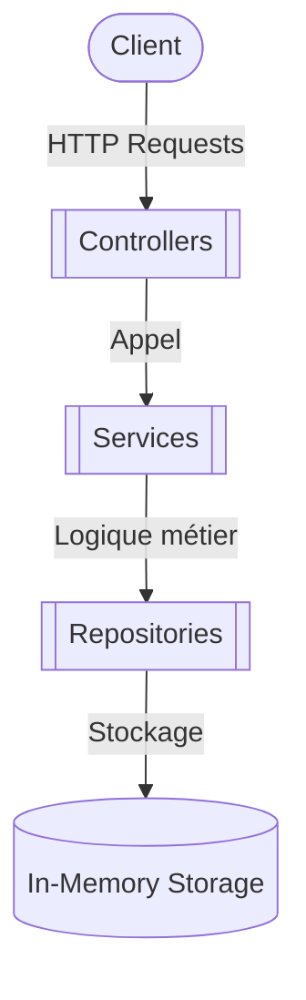
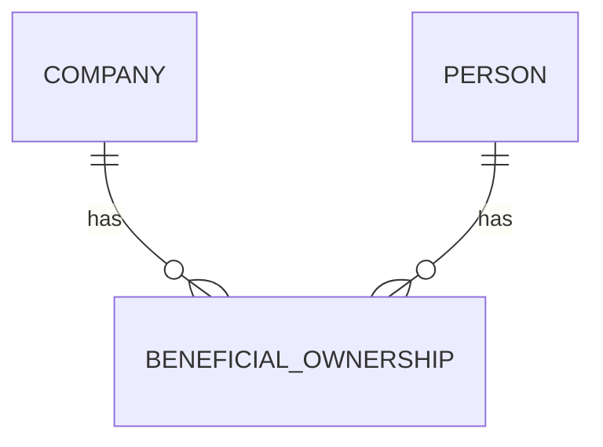
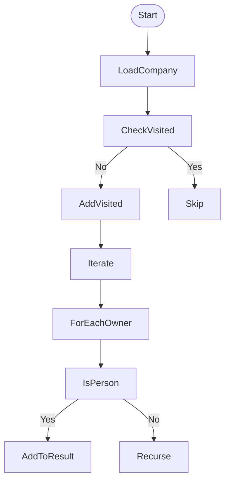

# DESIGN DECISIONS

This document outlines the key architectural and implementation decisions for the Beneficial Ownership API, focusing on clarity, scalability.

---

## 1. Layered Architecture

### Rationale

#### Separation of Concerns
Adheres to the classical 2-tier pattern for maintainability and testability:

- **Controllers**: Handle HTTP translation (`@RestController`).
- **Services**: Core business logic (e.g., `OwnershipCalculator`). 

## 2. Data Model

### Key Decisions

## 3. Ownership Calculation Algorithm

### Implementation Details

#### Recursion with Cycle Detection
- Prevents infinite loops (e.g., Company A → Company B → Company A)

#### Percentage Propagation
- Multiplies ownership percentages recursively
- Example:
    - Company A → Company B (30%) → Person X (40%)
    - Effective ownership = 30% * 40% = 12%

#### Threshold Filtering
- Post-process results to retain only owners with `totalPercentage > 25%`

#### Why Not Iterative BFS/DFS?
Recursion simplifies ownership chain modeling.

